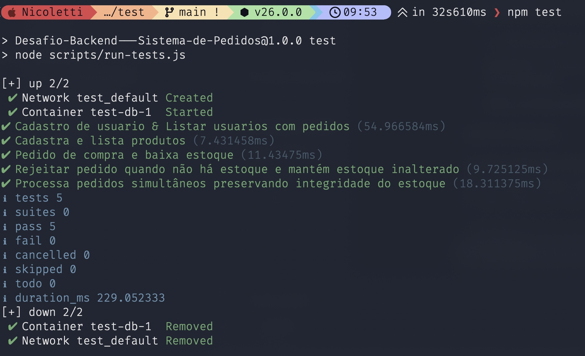

## Estrutura do DB

```sql
CREATE TABLE users (
    id SERIAL PRIMARY KEY,
    name VARCHAR(100) NOT NULL,
    email VARCHAR(100) UNIQUE NOT NULL,
    created_at TIMESTAMP DEFAULT NOW()
);

CREATE TABLE products (
    id SERIAL PRIMARY KEY,
    name VARCHAR(100) NOT NULL,
    price DECIMAL(10,2) NOT NULL,
    stock INT NOT NULL,
    created_at TIMESTAMP DEFAULT NOW()
);

CREATE TABLE orders (
    id SERIAL PRIMARY KEY,
    user_id INT REFERENCES users(id),
    total DECIMAL(10,2) NOT NULL,
    created_at TIMESTAMP DEFAULT NOW()
);

CREATE TABLE order_items (
    id SERIAL PRIMARY KEY,
    order_id INT REFERENCES orders(id),
    product_id INT REFERENCES products(id),
    quantity INT NOT NULL,
    price DECIMAL(10,2) NOT NULL
);
```

## Como executar

Rodar API e DB:

```bash
docker compose up --build
```

O API ficará disponível em:

```text
http://localhost:4000/
```

O endpoint GraphQL é o próprio endpoint HTTP do Apollo.

Também é possível rodar com Node.js e DB via Docker: 

```bash
npm install
npm run db:up
npm start
```

## Executando Testes

```bash
npm test
```
Os testes rodam um DB isolado na porta `55432`;
Se tiver um timeout no DB roda o comando novamente.

### Resultado esperado:


## Exemplos Para o Api

### Criar usuários:

```graphql
mutation {
  createUser(input: { name: "Hudson Nicoletti", email: "hudson@test.com" }) {
    id
    name
    email
  }
}
```

### Criar produtos:

```graphql
mutation {
  createProduct(input: {
    name: "Teclado Razer"
    price: "250.00"
    stock: 10
  }) {
    id
    name
    price
    stock
  }
}
```

### Criar pedidos:

```graphql
mutation {
  createOrder(input: {
    userId: "1"
    items: [
      { productId: "1", quantity: 2 }
    ]
  }) {
    id
    total
    items {
      productId
      quantity
      price
    }
  }
}
```

### Listar usuários e pedidos:

```graphql
query {
  users {
    id
    name
    email
    orders {
      id
      total
      items {
        quantity
        price
        product {
          id
          name
          price
        }
      }
    }
  }
}
```

### Listar produtos:

```graphql
query {
  products {
    id
    name
    price
    stock
  }
}
```

## Arquitetura                                                                                                                                    
- src/server.js: Inicia  Apollo, executa  migration.                                                                                                    
- src/graphql/schema.js: GraphQL queries/mutations.                                                                                          
- src/graphql/resolvers.js: Mapeia GraphQL pedidos a functions.                                                                    
- src/repositories/users.js: CRUD queries de usuarios.                                                                                                
- src/repositories/products.js: CRUD queries de produtos.                                                                                          
- src/services/orders.js: logica de criacao de pedidos..                                                                                           
- src/db.js: Postgres + migration/reset.                                                                                                      
- src/errors.js: Validacao/ error helpers.                                                                                                  
- src/mappers.js: GraphQL object mapping.  

## Decisões técnicas

A emissão de um pedido usa uma transação explícita:
    
1. Valide id de usuario e itens do pedido.                                                                                                               
2. Junta produtos duplicados.                                                                                                                  
3. Inicia transacao.                                                                                                                           
4. Verifica se usuario existe.                                                                                                                              
5. Trava cada produto com `SELECT ... FOR UPDATE`                                                                                         
6. Verifica o estoque.                                                                                                                                    
7. Faz o pedido.                                                                                                                                   
8. Insere os itens.                                                                                                                            
9. Diminui estoque.                                                                                                                         
10. Executa.                                                                                                                       
### Se qualquer etapa falhar, a transação executa um <font color="red"> `ROLLBACK` 🔄</font>.

Isso garante que pedidos simultâneos para o mesmo produto sejam serializados no banco. Quando o estoque chega a zero, a segunda transação enxerga o novo valor e recebe erro `INSUFFICIENT_STOCK`.

Os itens do pedido são agregados por produto e ordenados por `productId` antes de travar as linhas. Isso reduz risco de deadlock quando duas compras envolvem os mesmos produtos em ordens diferentes.

## Erros

A API retorna erros GraphQL com `extensions.code`, por exemplo:

- `VALIDATION_ERROR`
- `EMAIL_ALREADY_EXISTS`
- `USER_NOT_FOUND`
- `PRODUCT_NOT_FOUND`
- `INSUFFICIENT_STOCK`

## Trade-offs

- A API usa migração simples no startup (`CREATE TABLE IF NOT EXISTS`).
- Não há autenticação/autorização.
- Não há paginação nas listagens ou filtragem.
- Valores de especie  são enviados como `String` no GraphQL.

## O que faria diferente com mais tempo

- Adicionaria autenticação.
- Adicionaria paginação nas queries.
- Separaria migrações versionadas.
- Adicionaria observabilidade: logs estruturados, tracing e métricas.
- Adicionaria testes de API GraphQL ponta a ponta além dos testes de serviço.
- Adicionaria CI para rodar testes automaticamente em cada pull request no Github.
